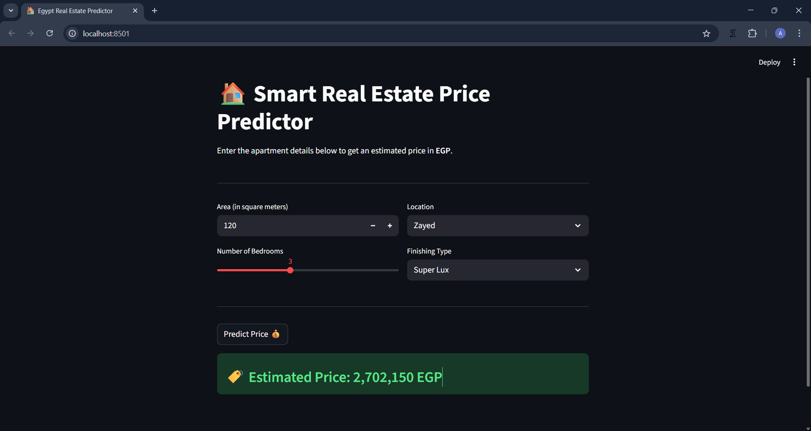

# 🏠 Smart Real Estate Price Predictor

A Full-Stack Machine Learning Web Application built with Python, Scikit-Learn, and Streamlit. This app predicts real estate prices in Egypt based on user inputs such as area, number of bedrooms, location, and finishing type.

## 📸 App Preview
<div align="center">
  
</div>

## ✨ Features
- **Machine Learning Model:** Utilizes a trained `RandomForestRegressor` for accurate price estimation.
- **Interactive UI:** Built with `Streamlit` to provide a seamless and user-friendly web interface.
- **Real-Time Predictions:** Instant price calculation based on the provided apartment features.

## 🛠️ Technologies Used
- **Python 3.x**
- `pandas` & `numpy` (Data manipulation)
- `scikit-learn` (Model training and preprocessing)
- `joblib` (Model saving/loading)
- `streamlit` (Web Application framework)

## 🚀 How to Run

1. **Clone the repository:**
   ```bash
   git clone https://github.com/Ahmed-Saeed-Abdullah-Alshanwany/Real-Estate-Predictor.git
   cd Real-Estate-Predictor


2. **Install the required dependencies:**
```bash
pip install pandas scikit-learn streamlit joblib


```

3. **Run the application:**
```bash
streamlit run app.py

```


